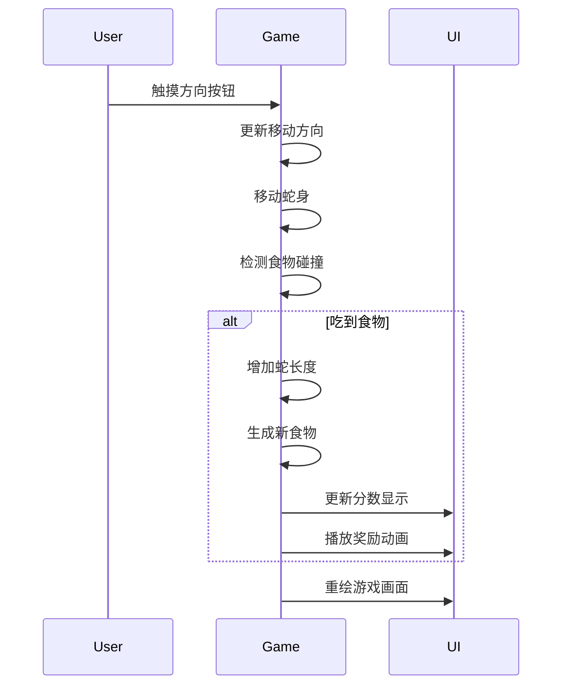

# 儿童贪吃蛇游戏需求文档

## 需求背景
为5岁儿童设计一款简单、友好的贪吃蛇游戏，可在iPad上安装和运行。游戏需要充分考虑幼儿的认知能力和操作习惯。

## 用户故事
- 作为5岁的小朋友，我想要一个颜色鲜艳、操作简单的游戏
- 作为家长，我希望游戏界面友好，没有复杂规则，适合幼儿玩耍
- 作为用户，我希望游戏能在iPad上流畅运行，触控操作灵敏

## 使用场景
- 家庭娱乐时间，家长陪伴孩子一起玩游戏
- 幼儿园或早教中心的数字启蒙活动
- 儿童独自探索和玩耍的简单游戏

## 技术方案
### 技术选型
- 使用HTML5 + CSS3 + JavaScript开发网页游戏
- 采用响应式设计，适配iPad屏幕尺寸
- 使用触摸事件处理，优化触控体验

### 核心特性
1. **简化规则**：只有前进和转向，无死亡机制
2. **视觉设计**：大按钮、鲜艳色彩、可爱图形
3. **操作方式**：触摸屏方向按钮控制
4. **奖励机制**：吃到食物时有动画和音效反馈

## 实现细节

### 数据实体设计
```javascript
// 游戏状态
class GameState {
  constructor() {
    this.snake = []; // 蛇身坐标数组
    this.food = {};  // 食物坐标
    this.direction = 'right'; // 移动方向
    this.score = 0;   // 当前得分
    this.highScore = localStorage.getItem('snakeHighScore') || 0; // 最高分
    this.isPlaying = false; // 游戏状态
    this.speedLevel = 'medium'; // 速度等级: slow, medium, fast
    this.gameHistory = JSON.parse(localStorage.getItem('snakeGameHistory') || '[]'); // 游戏历史记录
  }
}

// 游戏配置
const config = {
  gridSize: 15,      // 网格大小
  speedLevels: {     // 三档速度配置
    slow: 300,       // 慢速(ms)
    medium: 200,     // 中速(ms)
    fast: 100        // 快速(ms)
  },
  initialLength: 3,   // 初始蛇长度
  maxHistory: 10,     // 最大历史记录条数
  colors: {
    snake: '#4CAF50', // 蛇身颜色
    food: '#FF5252',  // 食物颜色
    background: '#F5F5F5', // 背景色
    button: '#2196F3', // 按钮颜色
    buttonActive: '#1976D2', // 按钮激活颜色
    score: '#FF9800', // 分数颜色
    highScore: '#E91E63' // 最高分颜色
  }
};
```

### 数据流设计
1. 用户触摸方向按钮 → 更新蛇的移动方向
2. 游戏循环定时器 → 移动蛇身 → 检测碰撞 → 更新游戏状态
3. 吃到食物 → 增加分数 → 生成新食物 → 播放奖励动画

### 逻辑时序设计


### 接口设计
```javascript
// 游戏控制接口
interface GameController {
  startGame(): void;
  pauseGame(): void;
  resetGame(): void;
  changeDirection(direction: string): void;
  changeSpeed(level: string): void; // 新增速度切换接口
}

// 渲染接口  
interface Renderer {
  drawSnake(snake: Array): void;
  drawFood(food: Object): void;
  drawGrid(): void;
  updateScore(score: number, highScore: number): void; // 更新为显示当前分和最高分
  drawSpeedButtons(): void; // 速度按钮渲染
  drawHistoryPanel(): void; // 新增历史记录面板
}
```

## 预期成果
- 一个完整的HTML5贪吃蛇游戏
- 适配iPad屏幕的响应式界面
- 简单直观的触摸控制
- 三档可调节的游戏速度
- 得分记录和历史对比功能
- 鲜艳友好的视觉设计
- 游戏可本地运行，也可部署到web服务器